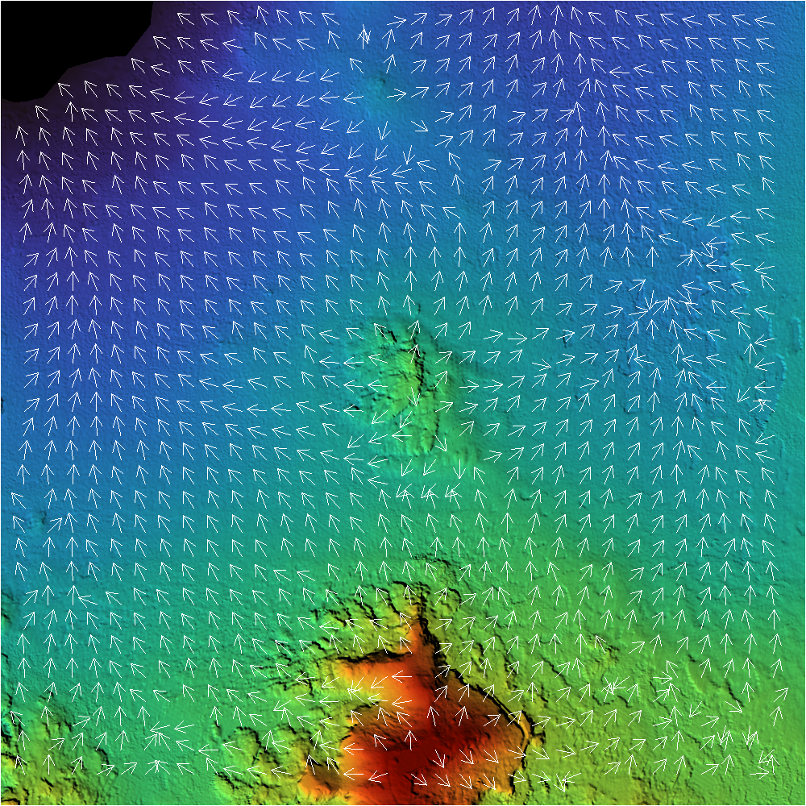
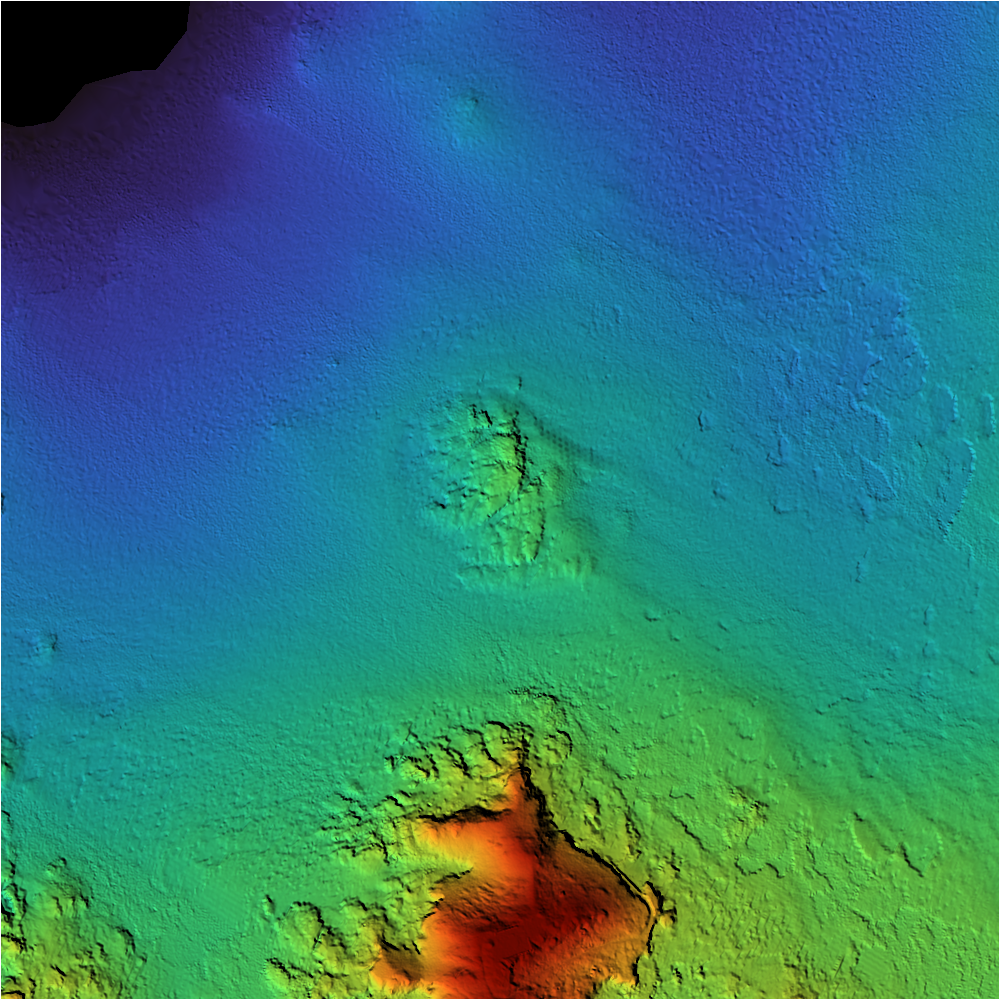

# Elevation Data Processing and Visualization

## Overview
This Rust project processes elevation data from ASC files, converts it into grayscale and RGB images, and generates hillshade visualizations. The tool provides functionalities to read ASC files, extract elevation data, normalize it, and apply grayscale or color gradients for visualization.

## Developers 
- Mahmoud Tarek Aboelrayat
- Youssief Morsy

## Features
- **Reads ASC elevation files**: Extracts elevation data and metadata.
- **Converts elevation data to images**:
  - Grayscale representation
  - RGB representation using a color gradient
- **Generates hillshade images**:
  - Grayscale hillshade
  - RGB hillshade
- **Timestamps output images** for versioning.
- **Gradient Field** *Additional Feature*:
  - Adding a gradient field for the map indicating the highest and lowest regions

 ## Output Examples

### RGB Hillshade Representation
This image represents the **final hillshade RGB representation** using a color gradient.



### Gradient Field Representation
This image represents the **gradient field**, highlighting the highest and lowest elevation regions.




## Dependencies
This project relies on several Rust libraries:
- `image` - For image processing and saving outputs.
- `colorgrad` - For applying color gradients.
- `chrono` - For timestamping output files.
- `anyhow` - For error handling.
- `std::fs` - For file operations.

## Installation
1. Ensure you have Rust installed: [Rust Installation](https://www.rust-lang.org/tools/install)
2. Clone this repository:
   ```sh
   git https://github.com/MahmoudAboelrayat/DEM_Rust.git
   cd DEM_Rust
   ```
3. Build the project:
   ```sh
   cargo build 
   ```
4. Download the dataset

## Usage
Run the program by providing an ASC file path:
```sh
cargo run -- path/to/elevation.asc
```
If no path is provided, the program uses a default ASC file with the location as the variable file_path.

**Note:** If you want to use the current code, you need to place the dataset in the specified folder.

## Output Files
- `output_YYYYMMDD_HHMMSS.png` - Grayscale elevation image
- `output_rgb_YYYYMMDD_HHMMSS_turbo.png` - RGB elevation image
- `hillshade_gray_YYYYMMDD_HHMMSS.png` - Grayscale hillshade
- `hillshade_rgb_YYYYMMDD_HHMMSS.png` - RGB hillshade

All output images are saved in the `src/output_img` directory.

## Running Test Cases

The following test cases are included to verify the functionality of the core functions in the project.

You can run all the tests with:

```sh
cargo test
```

## Test Cases Descriptions

### 1. **Test `read_file` Function**

- **Description**: This test ensures that the `read_file` function correctly reads the contents of an ASC file.
- **Details**: A dummy ASC file is created with known content. The function reads the file and compares the content with the expected value. After the test, the dummy file is deleted to clean up.

### 2. **Test `asc_to_image` with Valid Data**

- **Description**: This test checks if the `asc_to_image` function correctly parses a valid ASC data string into image data.
- **Details**: The ASC file content is well-formed, and the `asc_to_image` function is expected to parse it into an image. The test checks if the width, height, and data values are correct.


### 3. **Test `asc_to_image` with No Data Values**

- **Description**: This test checks how the `asc_to_image` function handles `nodata_value` in the ASC file content.
- **Details**: ASC content with a `nodata_value` of `-9999` is provided, and the function should convert these values to `NaN` in the resulting data.

### 4. **Test `asc_to_image` with Invalid Header**

- **Description**: This test ensures that the `asc_to_image` function returns an error when the header of the ASC file is invalid.
- **Details**: An invalid header with a non-numeric value (`abc` instead of a number for `ncols`) is passed in, and the function should return an error.

### 5. **Test `data_to_grayscale` with Basic Data**

- **Description**: This test checks if the `data_to_grayscale` function correctly maps data to grayscale values.
- **Details**: A basic vector of data is passed in, and the resulting grayscale image is verified by comparing individual pixels.

### 6. **Test `data_to_grayscale` with NaN Values**

- **Description**: This test checks how the `data_to_grayscale` function handles `NaN` values by mapping them to the minimum value of the grayscale range.
- **Details**: A vector containing a `NaN` value is passed in, and the function should map this `NaN` to the minimum grayscale value (i.e., `0`).

### 7. **Test `data_to_grayscale` with Constant Values**

- **Description**: This test checks if the `data_to_grayscale` function correctly handles constant values in the input data.
- **Details**: A vector with all values the same (`5.0`) is passed to the function, and all resulting pixels in the grayscale image should have the same value.

### 8. **Test `rgb` Function with Basic Data**

- **Description**: This test ensures that the `rgb` function correctly maps data to an RGB image.
- **Details**: A basic vector of data is passed into the `rgb` function, and the resulting RGB image is checked for width and height.

### 9. **Test `rgb` Function with NaN Values**

- **Description**: This test ensures that the `rgb` function handles `NaN` values correctly in the input data.
- **Details**: A vector containing a `NaN` value is passed into the function, and the resulting image is checked to ensure the `NaN` is handled correctly.

### 10. **Test `hill_shading` with Basic Data**

- **Description**: This test checks if the `hill_shading` function correctly maps data to both grayscale and RGB images based on a set of basic input data.
- **Details**: A 3x3 data matrix is passed to the `hill_shading` function, and the resulting images are checked for their width and height.

### 11. **Test `hill_shading` with NaN Values**

- **Description**: This test ensures that the `hill_shading` function handles `NaN` values correctly.
- **Details**: A matrix containing a `NaN` value is passed to the `hill_shading` function, and the output is verified to ensure the `NaN` is handled as expected.

### 12. **Test `hill_shading` Edge Cases**

- **Description**: This test ensures that the `hill_shading` function handles edge cases where the data matrix is very small or contains minimal variation.
- **Details**: A small 2x2 matrix is passed to the `hill_shading` function to check if the function handles small input sizes correctly.
